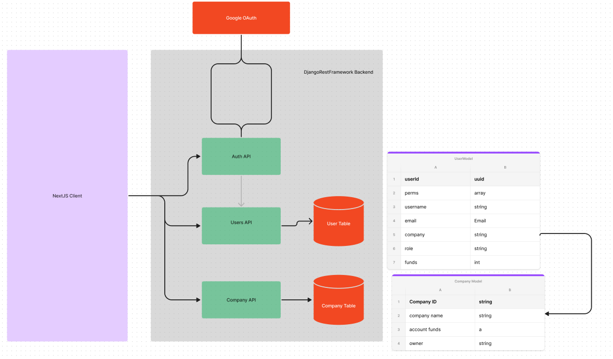

# CXNPL Identity Management Service - Constance

# Table of Contents

- [Scope](#scope)
- [Overview](#overview)
- [Design Details](#design-details)
- [Future Work](#future-work)

## Scope

The following IAM system is designed with the Constantinople business case in mind. An exhaustive list of business context are as follows:

- Constantinople’s current target market is SME banks.
- These SME banks can have businesses sign up for accounts
- Depending on SME size, different features are required:
  - Small SMEs (sole traders) may just need 1 user per account
  - Moderate sized SMEs: 2-5 users
  - Largest SMES (ME): SSO, MFA, password policies, external identity provider (Google, Facebook, Outlook, Instagram \***\*ie oAuth)\*\***, integrations, etc

Following the above, system assumptions were created and verified by Stella, CEO interviews, and engineering team:

- The system should serve the Australian market (single region server location)
- All users are within the region. ie.
- Estimate 5 million concurrent customers (From CEO interviews). 20% are businesses = 1 million
- Of the 1 million users: 10,000 users per hour = 200 requests per minute, 3 requests per second
- **Scaling is currently not an issue due to above metrics and will be discussed in the Future Works section**

As a result of the above, the high level scope of Constance includes SME support for users to:

- Login via Google OAuth
- Create companies
- Create users for your company
- Delete users for your company
- View permissions of authenticated user

# Overview

As a finance related IAM, authentication and authorization must be secure and grant permissions. Constance is likely to have users with varying degrees of permission including master users, administrators, and users. Furthermore, each company that utilizes our services is likely to be hosted on different servers and databases, utilizing a tenanted approach to system design which is discussed further in the Future Works section.

### High level features

- Users sign in using Google authentication which gives access to a company dashboard. If the user is new and does not belong to a company, they will be prompted to create a company and become its owner. They are then able to return to the dashboard and view all users that belong to their organization.
- Owners and company administrators are able to create users from the company dashboard. Owners may create owners, admins, and regular users. Admins may only create other users. Base users are unable to create accounts.
- Owners and company admins are authorized to delete users from their organization. In future, tiered permissions would work in a similar fashion to account creation where users can only delete other users with lower authorisation than themselves.
- All users that are authenticated have access to the user permissions dashboard which lists all actions they are authorized for.
- CRUD operations are possible for users and companies based on level of authorisation.

For the purposes of this project, a single database houses all data for companies and users. Permissions are granted in one of two ways: role-based and group-based authorization. The system backend can be

The system incorporates a REST APIs built on a Django server using, currently connected to a sqlite database. A simple custom UI has been built using NextJS written in typescript with TailwindCSS styling. Additionally, the NextAuth library is used as an external authentication library to allow social logins for ease of use for company owners.

Both the client and servers are hosted publicly on Railway linked here: [https://cxnpl-client-production.up.railway.app/]



# Setup

### Railway

As mentioned in overview, no setup is required as Constance has been hosted on Railway and is accessible via this link: [https://cxnpl-client-production.up.railway.app/]

### Local Setup

If you would like specific setup instructions to run the system locally, I'd be happy to draw up a quick guide.

### User Creation

The user creation page incorporates backend validation which has not been configured in the frontend. A created user must have:

- a valid email. ___@___.com
- matching passwords

# System Design Decisions

## Database design

Constance employes a relational SQLite database as the primary database. A relational database was chosen due to its structured approach in storing data which provides an easier way to model complex relationships in future. As Constance holds primarily user and company data linked by company ID, and RDB optimally allows for faster and more efficient queries.

As a system that will potentially house financial data, it is necessarily true that ACID transactions are supported in order to prevent errors in anything funds related. A RDB is able to deliver a high degree of data integrity, adhering strictly to principles of atomicity, consistency, isolation, and durability. It is true that Non-RDBS can demonstrate ACID principles by following BASE principles which result in eventual consistency, however this is unacceptable for any financial transaction related use cases, especially for that of large volume transactions involving banks

It is worth mentioning that the system currently utilizes SQLite which has suboptimal support for multiple-users. Therefore, a PostgreSQL database should be used and is discussed in the Future Works section.

## Detailed Design

### Authentication

The current system provides OAuth authentication for master users - ie company owners that can create an account using social logins such as Google. This high level approach ensures that core features of the service are accessible such as login, company CRUD, user CRUD, and viewing user permissions. However Django also provides a built in login page which allows username/password login which can be configured for company employees.

Constance utilizes NextAuth to implement OAuth. Currently Google is configured as the only social login provider, however Okta has been preconfigured for future builds as a business specific example due to its popularity amongst corporations. Once a user begins a login flow, they are sent to the social provider login page to authenticate with a Google social account of their choosing. Once authenticated, Django will create a new user in the database with the details of said user and its corresponding access token. This token is then saved in a JWT session and sent client-side to complete the authentication process. For all requests that the client makes, the JWT forms part of the request header which is then used for action authorizations.

### Authorization

In the backend are Django models (database tables) for companies and users. Companies are built with custom permissions for certain actions which are currently implemented as view based permissions using decorators. If the user does not have permissions, they will be redirected to a login page. Currently this feature is partially implemented in the backend.

```
    @permission_required(
        "accounts.can_delete_company", raise_exception=False, login_url="/api/auth/"
    )
```

Permissions in Django are set as array strings in the user model field and are assigned on user creation based on their role in the company. Therefore when CRUD operations are done on model instances, the model view will always check if the users user_permissions array contains the necessary permission. Attaching permissions to the user in this way ensures data consistency and improves security as authorization will always occur without needing to explicity call a helper function to determine permissions. It is worth noting however, that this is done in the SME context of this project and a tradeoff. Scaling up in the future would require a helper function which will return true if user has sufficienct permission which would improve code maintainability.

For future scalability, a method can be created which checks if a user has permissions for each view such as:

```
def has_perm(user):
    return user.has_perm(permission)
```

# Available APIs

## Auth

```
POST api/auth/
POST api/social/login/google/
```

Django-NextAuth integration API's. Handles the logic for social logins and account creation on successful authentication

User accounts APIs

```
POST accounts/register
```

Owners and company admins can create a user account for your company. Owners can create owners, admins and users. Admins can only create users.

```
DELETE accounts/delete
```

Currently implemented in the backend. Company owners can delete their company

```
GET user_info/<str:email>/
```

All authenticated users are able to return a list of user permissions and user attributes

```
POST company/create
```

Create a company. User will be assigned as the company owner and be granted all permissions. These permissions can be configured in model serializers depending on what permissions a company would like for each user

```
GET company/<str:email>/
```

Returns company data for the authenticated user based on their email address

# Future Work

### Multi-tenancy and Data Separation

In a world where data security is highly prioritised when it comes to new services, Constance should be run on a one client per server basis ie. each clients data should be hosted on a separate private cloud. In saying that, Constance's security based functionality should be highly configurable and company owners/admins should be able to add and remove security permissions via api

### Group-based Authorization

Currently, Constance supports role based authorization in which a user has permissions based on their current role. In more mature organizations, groups may be distinguished with the difference being:

- Role-based permissions depend on a user role, and are typically used to grant permissions ie. security admins, bankers, loan officers
- Group-based roles are inherited as a user enters a group. These are typically used as a means to organize users and can grant hierarchical authorizations. For example, a group for report editors may have update permissions for reports while a report writer would be part of group a lower level group with finer grain permissions which is included within a report editor group.
  The above distinction would become extremely important in larger and organizations, and therefore was not included in the current scope.

### Database considerations

Constance uses SQLite for its database. This should be converted to a PostgreSQL as it offers improved efficiency for shorter queries and an overall faster response time. Additionally, sqlite lacks the ability to handle multiple simultaneous access which for financial data is unacceptable.

In addition to RDS database considerations, a blob store such as AWS S3 would also be needed to store images and metadata. For example a user profile picture can be stored and its presigned url stored in another field on the user table

### Scalability, Availability, Latency

With Constantinople entering the global market, these out of scope attributes become increasingly important.

Horizontal scaling can be easily done via sharding on the user id. It is unlikely for a user data to casue high traffic for a banking system unless different services such as stock trading and social applications are introduced. However, if so, load balancing should be considered

Systems housing financial data need to be highly available, for both servers and the databases.Hosting the system on a highly available cloud provider such as Amazon EC2 and S3 buckets with 4 nines of availability and up to 11 9's of durability.

Under the assumption that Constance should act under a tenanted business model, latency may not be a big issue as private clouds can be hosted in different regions which serve the majority of users in a certain company.
