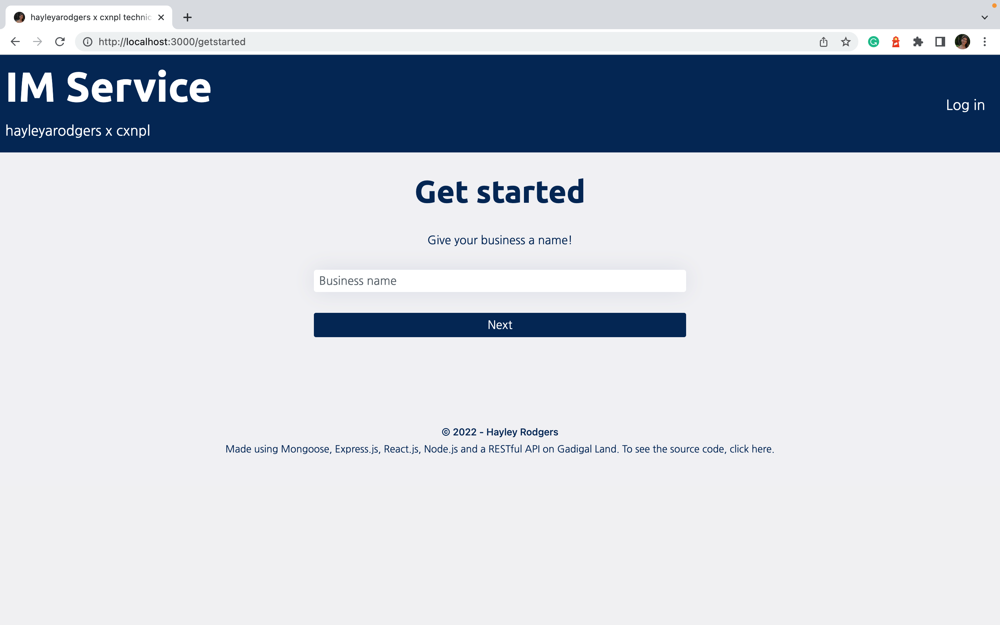
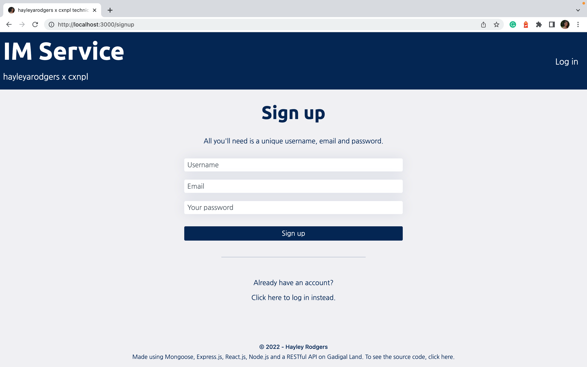
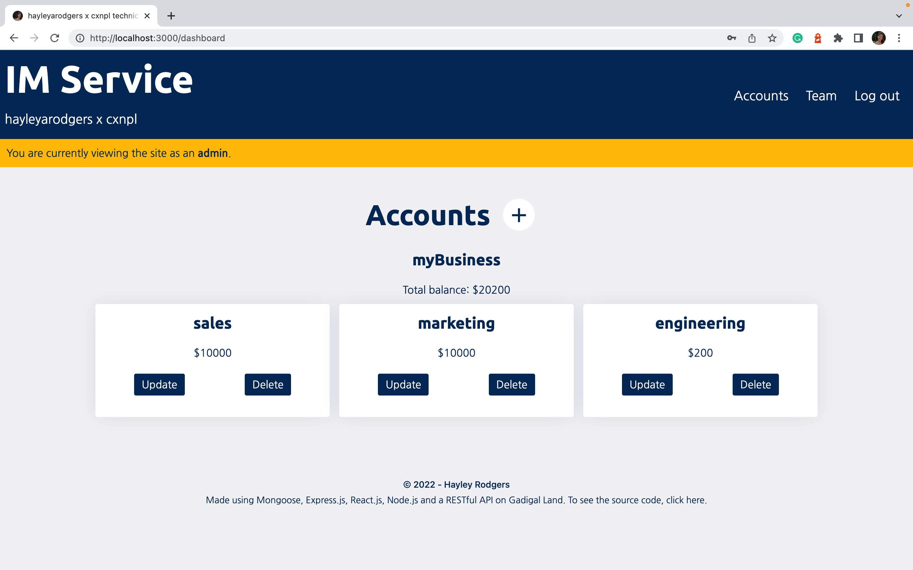
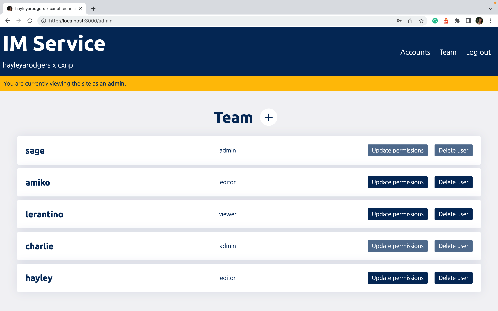
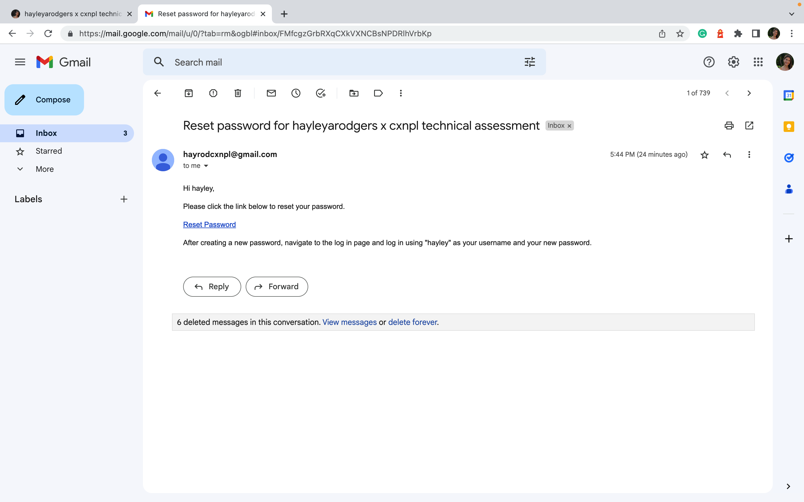
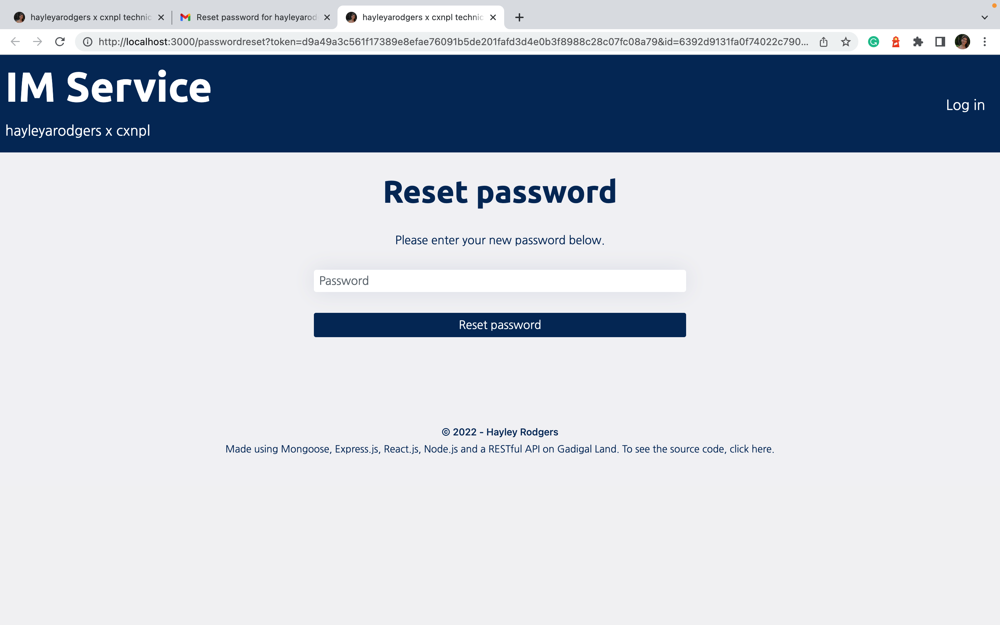
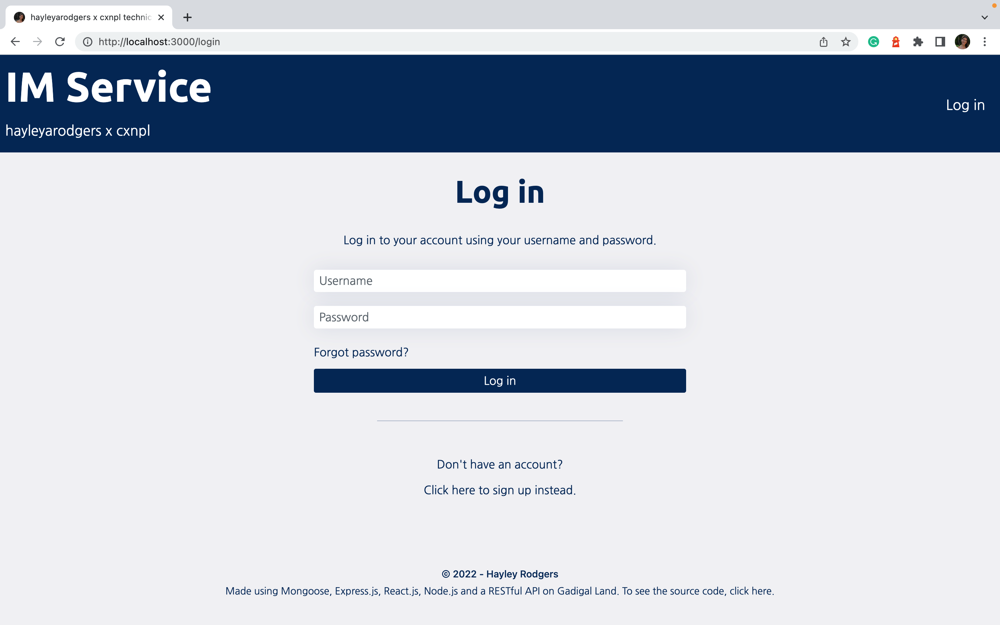

# hayleyarodgers x cxnpl technical assessment

## Table of Contents

- [Description](#description)
- [Scope](#scope)
- [Decisions](#decisions)
- [Access](#access)
- [Installation](#installation)
- [Usage](#usage)
- [Improvements](#improvement)
- [Credits](#credits)

## Description

My goal for this project was to build an identity management system and API to manage users and their permissions. The application I created achieves this by allowing users to log in to their business and create, view, update and/or delete its accounts depending on their role (as determined by an admin of the business).

There are three types of roles on the platform:

1. **Admins**, who have permission to create, view, update and delete accounts and users under their business.
2. **Editors**, who have permission to update accounts under their business.
3. And, **viewers**, who have permission to view accounts under their business.

The focus of this project is on **managing permissions**. To emphasise on this, the functionality of the site itself is quite simple—a "business" refers to a collection of accounts, whilst an “account” consists of a name and an amount of money.

## Scope

### Description of User Experience

A user creates a “business” and signs up. They are automatically an “admin” of their business.




Upon sign up, the admin is directed to an accounts dashboard. Here, they can:

- Create new accounts.
- View accounts under their business.
- Update existing accounts, eg. change name or amount.
- Delete accounts.



An admin also has access to the team page. Here, they can:

- Create new users under their business.
- View users under their business.
- Update the permissions of existing users, eg. if they’ve changed roles.
- Delete users, eg. if they’ve left the business.



To log into an existing business:

- A user must be added to the business (ie. created) by an existing admin.
- Then, a new user goes to the log in page and selects “forgot password”.
- After entering their email, they will be sent an email with a link to reset/choose their password.
- After resetting their password, they can use it to log in.

Then depending on whether the user is an admin, editor or viewer, they will have different permissions once logged in.





### Walkthrough of User Experience

To a video walkthrough of this project, [click here](./assets/walkthrough/walkthrough.mp4).

### Wireframes of Application

To see the wireframes for this project, [click here](./assets/wireframes/hayleyarodgers-x-cxnpl-assessment-wireframe.pdf).

## Decisions

Key decisions and trade offs during production included:

### Permissions can become out of sync between front and back ends

I decided to make a [permissions.js](./server/utils/permissions.js) file in the back end to control which users can make certain requests. These permissions are then accessed by [auth.js](./server/utils/auth.js), which is then accessed as authorisation middleware on the routes. I did this so that the permissions could all be seen clearly (and edited easily) in one place.

However, this came with a couple of trade-offs.

Firstly, there is a lot of duplication in the current versions of auth.js and permissions.js. Although this means that the permissions have alot of _potential_ to be very specific, most of the current code repeatedly requires that a user's role is "admin".

Another trade off is that this specificity is not easily replicable in the front end and there is potential for the two to get out of sync. That is, if permissions are changed in the back end, the front end will not adapt with it and will have to be manually changed. This is because there are specific authorisation functions (ie. isAdmin() and isEditor()) that are littered throughout the front end code to selectively render components and control API requests. As an example: "editors" can currently only update accounts. If we wanted to make it so that editors could delete accounts, this would be easily achieved in the back end. However, enabling this in the front end would require sorting through and adding isEditor() in numerous different places so that the components render and authorisation tokens can be retrieved.

Ultimately, the current approach works but it isn't perfect—it doesn't really suit the back end as there is lots of duplication, and it doesn't really suit the front end as it isn't very scalable for changing permissions in the future.

### Data is saved in local storage

Three key pieces of information that are required for site functionality are saved in local storage:

1. The business id, which is used to retreive account data after a user has logged in.
2. The user's role, which is checked and used for authorisation at numerous points.
3. And, the user's JWT token, which is used for authorisation.

This was the easiest way to save and retrieve information used repeatedly through the application. However, having any information in local storage (encrypted or not) isn't ideal because it opens the door to potential exploitation.

### Admins can't update or delete admins

Because admins can update permissions, they could potentially change everyone's admin permissions to viewer or editor... including their own. This would make most of the site's functionality inaccessible from the client-side if all admins were to be changed into viewers and editors.

To prevent this, I disabled updates and deletion of all admins. Although this prevents the issue, it is a blanket solution that may be inconvenient if a user wants to update or delete an admin—they have no way of doing this themselves.

### Users can only be associated with one business

Initially, businesses and users were only directly linked via the "team" field on the Business model. However, I realised that if a user was to log in using only their credentials, they needed the business id directly linked to their profile (the only other alternative would have been to search every business for the user... which seemed inefficient).

So, I added a "businessId" field to the User model that could then be saved to local storage when the user logs in and retrieved as necessary to CRUD business data. The trade-off is that a user can only be associated with one business. Another trade-off was that the business needed to be created before the first user could sign up so this information can be copied into their data.

## Access

### Code Repository

The repository where the code is saved is on Github. To access it, click [here](https://github.com/cxnpl-au/recruitment).

### Live Application

The application is deployed on Heroku. To access it, click [here](https://hayleyarodgers-cxnpl.herokuapp.com/).

## Installation

To install necessary dependencies, run the following command:

```
npm i
```

## Usage

To use the application from the command line (after installing dependencies):

1. Open the root directory of the repository in your terminal or bash.
2. Create a .env file in the format of [.env.EXAMPLE](./.env.EXAMPLE). To interact with the complete application, enter `npm run develop` in the command line and go to port 3000 on your local host. Alternatively, to interact with the server, enter `npm run start`.
3. To deploy the application yourself, enter `npm run build` and deploy to your platform of choice.

Alternatively, to use the live application, click [here](https://hayleyarodgers-cxnpl.herokuapp.com/).

## Improvements

Some areas for improvement include:

- Finding a way to achieve functionality without saving JWTs and other information in local storage.
- Adding the ability to log in as a demo user to model how the application works.
- Building out more specific alerts on the front end to communicate why certain requests aren't working instead of just "Something went wrong..." etc.
- Automatically redirecting users to the home page when their session has expired.
- Creating an interface that would allow an admin to customise new types of permissions beyond the general categories of "admin", "editor" and "viewer".
- Sending newly created users an email with their log in details and a link to reset their password.
- Replacing window.location.assign() in the front-end to change the page directory without reloading, like a true single page application.
- Creating a middleware to replace try...catch error handling in server routes, or investigate using a package (eg. express-async-errors) to do so.
- Adding multi-factor authentication to log in.
- Adding SSO to sign up and log in.

## Credits

I used:

- [React](https://reactjs.org/) as my front end framework.
- [React-Bootstrap](https://react-bootstrap.github.io/getting-started/introduction/) for most of my CSS styling.
- A RESTful API with an [Express](https://expressjs.com/) server.
- [ReactDOM](https://reactjs.org/docs/react-dom.html) and [React Router](https://v5.reactrouter.com/web/guides/quick-start) to navigate through my front end.
- A [MongoDB](https://www.mongodb.com/) database.
- [Mongoose](https://www.npmjs.com/package/mongoose) to connect and interact with my database.
- [bcrypt](https://www.npmjs.com/package/bcrypt) package to hash passwords.
- [JSON web tokens](https://www.npmjs.com/package/jsonwebtoken) and [jwt-decode](https://www.npmjs.com/package/jwt-decode) for authentication.
- [nodemailer](https://nodemailer.com/about/), [nodemailer-express-handlebars](https://www.npmjs.com/package/nodemailer-express-handlebars) and [googleapis](https://www.npmjs.com/package/googleapis) to send password reset emails.
- [This tutorial](https://www.freecodecamp.org/news/use-nodemailer-to-send-emails-from-your-node-js-server/) to help me learn how to use nodemailer.
- [This tutorial](https://blog.logrocket.com/implementing-a-secure-password-reset-in-node-js/) to help me learn how to implement password reset.
- [This tutorial](https://www.youtube.com/watch?v=jI4K7L-LI58) to help me learn how to implement user roles and permissions.
- [This tutorial](https://coding-boot-camp.github.io/full-stack/mongodb/deploy-with-heroku-and-mongodb-atlas) for deploying to Heroku.
- [This guide](https://www.creatopy.com/blog/google-font-pairings/) to select a font pairing.
- [This colour palette generator](https://coolors.co/palette/000814-001d3d-003566-ffc300-ffd60a) to create a theme.
